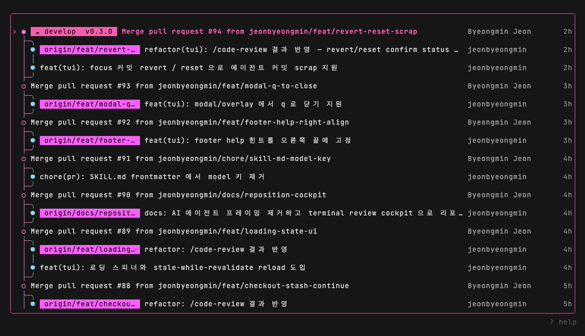

<div align="center">

# gh-orbit

로컬 git 을 터미널에서 리뷰하는 `gh` CLI 익스텐션 — 커밋 그래프, diff, 브랜치, worktree 를 키보드 중심의 단일 화면에서.

[](https://github.com/jeonbyeongmin/gh-orbit/releases)
&nbsp;[](https://github.com/jeonbyeongmin/gh-orbit)
&nbsp;

[English](./README.md) · 한국어



</div>

---

gh-orbit 은 저장소의 커밋 그래프, 커밋·워킹 트리 diff, 브랜치, worktree 를 하나의 터미널 UI 에서 보여준다. 모든 git 동작은 사용자의 `git` 바이너리로 shell-out 되므로 `.gitconfig`, 훅, 커밋 서명, LFS 가 그대로 동작하고, PR 데이터는 `gh` CLI 에서 가져온다.

## 설치

```bash
gh extension install jeonbyeongmin/gh-orbit
gh orbit
```

git 저장소 안에서 `gh orbit` 을 실행한다.

## 내부에서 실행되는 git / gh

각 동작은 사용자의 `git` / `gh` 를 실행한다 — gh-orbit 은 인터페이스이지 재구현이 아니다.

| 동작 | 실행 |
| --- | --- |
| 커밋 그래프 (실행 시) | `git log --all --graph --oneline --decorate` |
| `d` patch 오버레이 + `[` / `]` | `git show -p <commit>` 을 파일 단위로 |
| `,` Local Changes + `space` | `git status` + `git diff` + `git add` / `git restore --staged` |
| `enter` (체크아웃 / fast-forward) | `git checkout <branch>` / `git merge --ff-only <ref>` |
| `w` worktree (전환 / 추가 / 제거) | `git worktree list` / `add` / `remove` |
| `b` → `d` (브랜치 삭제) | `git branch -d <branch>` |
| `Z` (좀비 정리) | `git branch --merged` + `git branch -d` 반복 |
| `c` / `R` | `git cherry-pick <commit>` / `git rebase <onto>` |
| `v` / `x` | `git revert <commit>` / `git reset --soft\|--mixed\|--hard <commit>` |
| `n` | `git checkout -b <name> <commit>` |
| `F` / `p` / `P` | `git fetch --all` / `git pull` / `git push` |
| `o` (PR 웹에서 열기) | `gh pr view --web <number>` |
| `O` → `a` / `m` (PR 리뷰) | `gh pr diff <n>` · `gh pr review --approve` · `gh pr merge --squash\|--merge\|--rebase` |
| 브랜치 칩의 PR 배지 | `gh pr list` + `gh pr checks <number>` |
| `y` | `git rev-parse <commit>` → 클립보드 |

## 기능

### 커밋 그래프

- 실행 시 모든 로컬 브랜치·리모트·태그를 하나로 묶은 통합 그래프 (`--all`).
- 점 어휘: `●` 커밋 · `○` 머지 · `◉` HEAD. 레인 색상은 8색 팔레트를 순환한다.
- 각 행은 `그래프 │ 메시지(칩 + 제목) │ 작성자 │ 작성 시각` 으로 읽힌다. 시각은 오른쪽 끝에 고정되어 항상 보이고, 메시지 열이 truncation 을 흡수하며 제목이 1 cell 밑으로 줄기 전에 칩·작성자가 그 순서로 빠진다.
- 브랜치/태그 decoration 은 칩으로 렌더된다. 매칭되는 열린 PR 에는 `#N` 배지와 CI 롤업 글리프(`✓` 통과 · `✗` 실패 · `○` 진행 중)가 붙고, 실행 시·`r`·매 fetch/pull 후 갱신된다. GitHub 리모트가 없으면 배지를 생략한다.
- reload 는 stale-while-revalidate: 새 그래프가 스트리밍되는 동안 현재 그래프가 화면에 남는다.

### diff 리뷰

- `d` 는 focus 커밋의 전체 patch(`git show -p`)를 전체 화면 오버레이로 연다.
- `[` / `]` 는 패치 안에서 파일을 오가고, 하단에 `<path> [N/M]` 이 표시된다.
- `,` 는 Local Changes 를 연다 — 워킹 트리 diff(파일 트리 + diff 패널)를 Conflicts / Unstaged / Staged 로 나눈다. `space` 로 focus 파일 stage/unstage, `tab` 으로 트리 ↔ diff focus 순환, `r` 로 reload.

### PR 리뷰 (`O`)

- 칩에 열린 PR 배지가 달린 커밋에서 `O` 는 그 PR 의 diff(`gh pr diff`)를 커밋 diff 가 쓰는 것과 같은 전체 화면 patch 오버레이로 가져온다 — `[` / `]` 파일 네비와 스크롤이 동일하게 동작한다.
- `a` 는 approve(`gh pr review --approve`), `m` 은 merge — 전략을 인라인으로 고른다: `[s]` squash · `[m]` merge · `[r]` rebase(`gh pr merge`). 둘 다 오버레이 하단 힌트 줄에서 확인하므로 결정하는 동안 diff 가 화면에 남는다.
- approve 는 오버레이를 유지하고(계속 읽거나 이어서 merge), merge 는 그래프로 닫히며 PR 배지를 갱신한다. gh 에러(본인 PR approve, merge 불가, 로그아웃 상태)는 힌트 줄에 표시된다.

### worktree (`w`)

- `enter` 는 UI 전체를 다른 worktree 로 프로세스 내부에서 전환한다.
- `a` 로 worktree 추가(형제 경로 자동 도출), `d` 로 제거(dirty/locked 는 force 확인), `s` 로 마지막 커밋 시각순 정렬.
- 각 행에 `●` dirty 마커와 worktree HEAD 의 마지막 커밋 제목·상대 시각이 표시된다.
- `.git/HEAD` 와 `.git/index` 를 fsnotify 로 감시해 외부 커밋·rebase 가 목록을 갱신하고, `r` 은 항상 수동 폴백이다.

### 브랜치 & 체크아웃

- 그래프에서 `enter` 는 커서의 칩 상태와 HEAD 관계로 체크아웃 / fast-forward / detach 를 고른다. 모호한 행은 브랜치 피커를 열고, 리모트-칩 행은 `git pull` 을 이어 붙인다.
- 체크아웃이 깨끗한 트리를 요구하면 `s` 로 stash 후 계속, `a` / `esc` 로 중단한다.
- `n` 은 커서에 브랜치를 만들고 전환한다.
- `b` 는 로컬 브랜치를 나열하고 `d` 로 커서 브랜치를 삭제한다(HEAD 보호).
- `Z` 는 기본 브랜치에 머지됐고, upstream 이 `[gone]` 이며, 어디에도 체크아웃되지 않은 브랜치를 한 번의 확인으로 일괄 삭제한다(reflog 복구 힌트 포함).

### 히스토리 조작

- `c` 는 커서 커밋을 현재 브랜치에 cherry-pick, `R` 은 현재 브랜치를 커서 커밋 위로 rebase 한다.
- `v` 는 커서 커밋을 revert 한다(새 커밋 기록; 이미 push 된 히스토리에도 안전).
- `x` 는 현재 브랜치를 커서 커밋으로 reset 한다 — `[s]` soft / `[m]` mixed / `[h]` hard. push 된 히스토리를 다시 쓰는 reset 은 거부하고 `v` 로 안내한다.
- 네 가지 모두 확인 우선이며, 충돌은 워킹 트리에 남겨 터미널에서 해결한다.

### 네트워크 & 그 외 키

- `F` fetch(`git fetch --all`) · `p` pull(strategy 해석) · `P` push(첫 push 는 upstream 설정; 절대 force 안 함).
- `o` 는 focus 커밋의 PR 을 GitHub 에서 열고 · `y` 는 커밋 해시 복사 · `r` 은 refs + log reload.
- `?` 는 인라인 help 패널을 토글한다(Global / Graph / Local Changes 컬럼).

## 키 바인딩

| 키 | 위치 | 동작 |
| --- | --- | --- |
| `j` / `k` · `g` / `G` | 그래프 | 이동 · 맨 위 / 맨 아래로 |
| `enter` | 그래프 | 체크아웃 / fast-forward / detach |
| `d` | 그래프 | 전체 화면 patch 오버레이 열기 |
| `O` | 그래프 | 커서 PR 의 diff 를 리뷰 오버레이로 열기 |
| `[` / `]` | 패치 | 이전 / 다음 파일로 점프 |
| `a` / `m` | PR 리뷰 | 열린 PR approve / merge (`m` → s/m/r) |
| `,` | 전역 | Local Changes 뷰 |
| `space` | local changes | focus 파일 stage / unstage |
| `w` / `b` | 전역 | worktree / 브랜치 모달 |
| `c` / `R` / `v` / `x` | 그래프 | cherry-pick / rebase / revert / reset |
| `n` | 그래프 | 커서에 브랜치 생성 + 전환 |
| `F` / `p` / `P` | 전역 | fetch / pull / push |
| `o` / `y` | 그래프 | GitHub 에서 PR 열기 / 해시 복사 |
| `Z` / `r` | 전역 | 좀비 브랜치 정리 / reload |
| `?` | 전역 | help 패널 토글 |
| `ctrl+c` `ctrl+c` | 전역 | 종료(두 번 누르기) |

## 설정

XDG 규격 경로(`internal/config` 가 해석 담당):

- 환경설정 — `$XDG_CONFIG_HOME/gh-orbit/config.toml`(선택):

  ```toml
  [pull]
  strategy = "rebase"   # "ff-only" | "merge" | "rebase"
  ```

  pull strategy 해석 순서: 환경설정 `[pull] strategy` → git config `pull.rebase` → `pull.ff` → 폴백 `--ff-only`.
- 로그 — `$XDG_STATE_HOME/gh-orbit/log`(TUI 가 stdout 을 소유하므로 런타임 로깅이 여기로 간다).

## 로드맵

1. Local Changes 의 per-hunk staging.
2. PR 리뷰: request-changes / comment(본문 에디터), 그리고 로컬에 체크아웃되지 않은 PR 까지 닿는 PR 목록.

## 개발

```bash
go run ./cmd/orbit                    # cwd 저장소 대상으로 실행
go test ./...                         # 테스트
golangci-lint run                     # 린트
tail -f ~/.local/state/gh-orbit/log   # 런타임 로그 추적 (TUI 가 stdout 소유)
```

데모 GIF 는 [VHS](https://github.com/charmbracelet/vhs) 로 재생성한다:

```bash
go build -o /tmp/orbit-demo ./cmd/orbit
vhs docs/assets/demo.tape
```

기능 단위 레퍼런스는 [`docs/`](./docs/) 참고 — [`docs/index.md`](./docs/index.md) 에서 시작.
