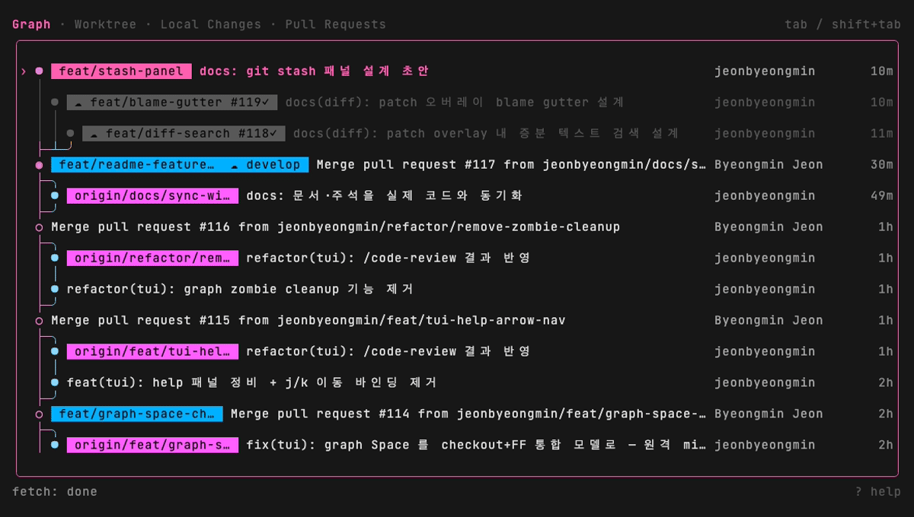
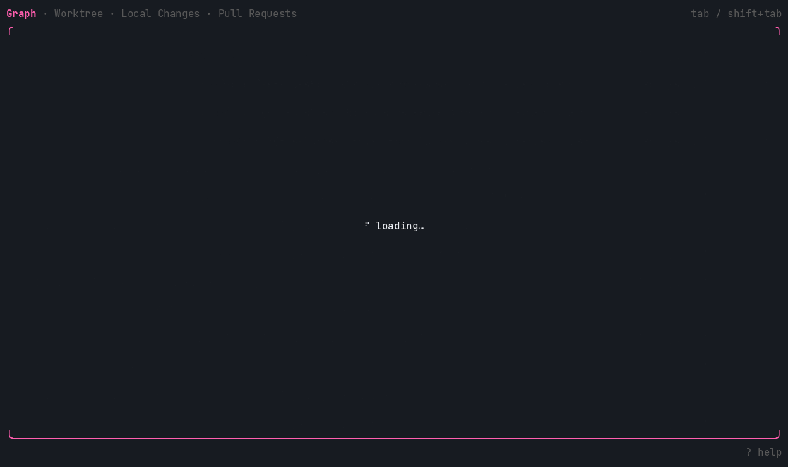
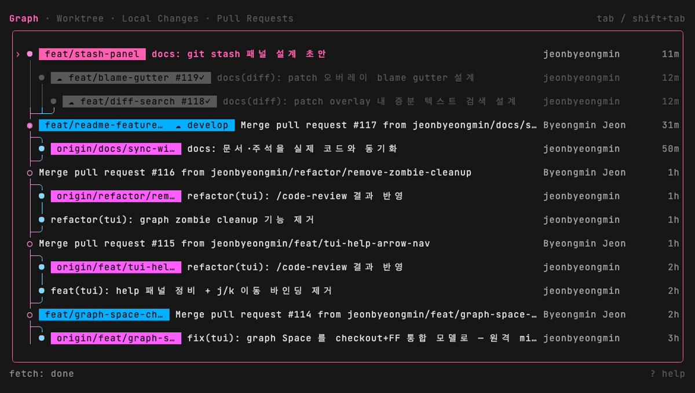

<div align="center">

# gh-orbit

A `gh` CLI extension that gathers every worktree's open PR — commit graph, diffs, and CI status — into one terminal dashboard. Inspect each branch's diff and CI, then land its PR straight from the terminal.

[](https://github.com/jeonbyeongmin/gh-orbit/releases)
&nbsp;[](https://github.com/jeonbyeongmin/gh-orbit)
&nbsp;

English · [한국어](./README.ko.md)


</div>

---

Your work spreads across worktrees — a stack of feature branches you're juggling, or a few coding agents running in parallel. Each has its own commit graph, uncommitted diff, and open PR with its own CI state. Keeping track of all of them usually means switching between `git`, `gh`, and a pile of browser tabs.

gh-orbit pulls it all into one place. The worktree dashboard shows every branch's PR and CI status at a glance, `→` opens any commit's full diff, and `m` lands the PR. The git, CI, and merge loop stays in the terminal; reviewing a PR (comments, approvals) is one browser jump away. No git operation is reimplemented: every action shells out to your own `git` / `gh`, so `.gitconfig`, hooks, commit signing, and LFS keep working unchanged.

## Where it fits

[lazygit](https://github.com/jesseduffield/lazygit), [tig](https://github.com/jonas/tig), and [gitui](https://github.com/extrawurst/gitui) cover one working tree's git well (staging, rebasing, history); [jj](https://github.com/jj-vcs/jj) rethinks the model underneath. [gh-dash](https://github.com/dlvhdr/gh-dash) covers the GitHub side: PRs and issues across repos, straight from the API. Neither half sees the other — lazygit doesn't know your PRs or CI, and gh-dash doesn't know your local worktrees or diffs.

gh-orbit lives in that gap. On a single branch it already helps — graph, diff, PR, and CI in one place, landed with `m`. It pays off most when several worktrees are live at once (a long-running feature, a hotfix, a review checkout, no stashing between them): each is tied to its PR and CI, so you can tell which worktree a failing check belongs to and land that PR without re-finding the branch in another tool. The more branches you keep in flight, the more it saves.

## Install

```bash
gh extension install jeonbyeongmin/gh-orbit
gh orbit
```

Run `gh orbit` inside any git repository. The graph, diff, and worktree views work anywhere; the PR and CI features need the [`gh`](https://cli.github.com/) CLI authenticated (`gh auth login`) and a GitHub remote. Without those, the PR and CI columns are simply omitted (no errors).

## Underlying git / gh

Each action runs your own `git` / `gh` — here is exactly what each key shells out to:

| Action | Runs |
| --- | --- |
| Commit graph (on launch) | `git log --all --format=…` (graph lanes drawn in-process, not by `git --graph`) |
| `→` patch overlay + `[`/`]` · `{`/`}` | `git show -p <commit>`, navigated by hunk · by file |
| Local Changes (`tab` cycle) + `space` | `git status` + `git diff` + `git add` / `git restore --staged` |
| `space` (diff pane, selected hunk) | per-hunk `git apply --cached` (`--reverse` to unstage) |
| `c` (local changes) | `git commit -m <msg>` |
| `C` / `ctrl+x` (local changes, mid-conflict) | `git <cherry-pick\|rebase\|merge\|revert> --continue` / `--abort` |
| `space` (checkout / fast-forward) | `git checkout <branch>` / `git merge --ff-only <ref>` |
| `tab` → Worktrees (switch / add / remove) | `git worktree list` / `add` / `remove` |
| `b` → `d` (delete branch) | `git branch -d <branch>` |
| `c` / `R` | `git cherry-pick <commit>` / `git rebase <onto>` |
| `v` / `x` | `git revert <commit>` / `git reset --soft\|--mixed\|--hard <commit>` |
| `n` | `git checkout -b <name> <commit>` |
| `F` / `p` / `P` | `git fetch --all` / `git pull` / `git push` |
| `enter` (open PR on the web) | `gh pr view <n> --web` |
| `m` (merge PR) | `gh pr merge --squash\|--merge\|--rebase` |
| Pull Requests tab | `gh pr list` (reused) → `enter` opens a row on the web, `m` merges it |
| PR badges on branch chips | `gh pr list` + `gh pr checks <number>` |
| `y` | `git rev-parse <commit>` → clipboard |

## Features

### Commit graph


- Unified graph across all local branches, remotes, and tags (`--all`) on launch.
- Dot vocabulary: `●` commit · `○` merge · `◉` HEAD. Lane colors rotate an 8-hue palette.
- Each row reads `graph │ message (chips + subject) │ author │ authored time`. Time is right-anchored and always visible; the message column absorbs truncation, dropping chips then author before the subject shrinks below one cell.
- Branch/tag decorations render as chips. A matching open PR adds a `#N` badge with a CI rollup glyph (`✓` pass · `✗` fail · `○` running), refreshed at launch, on `r`, and after each fetch/pull. Repos with no GitHub remote omit the badge.
- Reloads are stale-while-revalidate: the current graph stays on screen while the new one streams in.

### Diff review



- `→` opens the focused commit's full patch (`git show -p`) as a full-screen overlay.
- `[` / `]` move between hunks inside the patch, `{` / `}` jump file-to-file; the footer shows `<path> [N/M]`.
- The **Local Changes** page (in the `tab` / `shift+tab` cycle) is a working-tree diff (file tree + diff pane) split into Conflicts / Unstaged / Staged. `→` enters the diff pane, `←` returns to the tree, `space` stages/unstages the focused file, `c` commits the staged index (message prompt; your `.gitconfig`, hooks, and signing all apply), `r` reloads. When a cherry-pick / rebase / merge / revert stops mid-conflict, a banner appears here: stage your resolutions and press `C` to continue, or `ctrl+x` to abort.
- Per-hunk staging: `tab` into the diff pane, `[` / `]` move between hunks (the selected `@@` header is highlighted), and `space` stages just that hunk (`git apply --cached`) — or unstages it when viewing a staged entry. Untracked / conflict files stage whole-file from the tree.

### Pull requests (`enter` / `m` / the Pull Requests tab)


Reviewing happens on GitHub; gh-orbit jumps you there, and lands the PR from the terminal.

- `enter` on a commit whose chip carries an open-PR badge opens that PR on GitHub in your browser (`gh pr view --web`). The same web jump is wired to `enter` on the Worktree and Pull Requests pages.
- `m` merges the cursor row's open PR via a centered confirm dialog — `[s]` squash · `[m]` merge · `[r]` rebase (`gh pr merge`). Merge closes the dialog and refreshes the PR badges; gh errors (not mergeable, logged-out `gh`) surface on the status line.
- The **Pull Requests tab** (last in the `tab` / `shift+tab` cycle) lists every open PR — including ones whose head branch isn't checked out locally (which the graph cursor can't reach). Rows read `#N <CI glyph> title · author`; `enter` opens the cursor row on the web, `m` merges it, `r` refreshes the list.

### Worktrees (`tab`)



- `tab` cycles to a full-screen dashboard — one 3-line card per worktree (branch + PR/CI + dirty/time · path · last commit) — so every tree's state reads at once. `tab` / `shift+tab` move on to the next / previous page.
- `space` switches the whole UI to another worktree in-process; `enter` opens that worktree's open PR on GitHub in the browser — review each PR on the web, land it with `m` from the graph / Pull Requests tab.
- `a` adds a worktree (sibling path auto-derived), `d` removes it (force-confirm for dirty/locked), `s` sorts by last-commit time.
- Each card carries an open-PR `#N` + CI badge (when the branch has one), the `↑a↓b` ahead/behind vs upstream, a `●N` dirty marker (`N` changed files), and the worktree HEAD's last-commit subject and relative time.
- `.git/HEAD` and `.git/index` are watched (fsnotify), so external commits/rebases refresh the list; `r` is always a manual fallback.

### Branches & checkout



- `space` on the graph picks checkout / fast-forward / detach from the cursor's chips and HEAD relationship. Ambiguous rows open a branch picker.
- When checkout needs a clean tree, `s` stashes and continues, `a` / `esc` aborts.
- `n` creates a branch at the cursor and switches to it.
- `b` lists local branches; `d` deletes the cursor branch (HEAD protected).

### History operations

- `c` cherry-picks the cursor commit onto the current branch; `R` rebases the current branch onto the cursor commit.
- `v` reverts the cursor commit (records a new commit; safe on pushed history).
- `x` resets the current branch to the cursor commit — `[s]` soft / `[m]` mixed / `[h]` hard. A reset that would rewrite already-pushed history is refused and steered to `v`.
- All four confirm first. A conflict surfaces in the **Local Changes** page, where you stage your resolutions and press `C` to continue (or `ctrl+x` to abort the operation) — no shell round-trip. You can still resolve in your terminal if you prefer.

### Network & other keys

- `F` fetch (`git fetch --all`) · `p` pull (strategy-resolved) · `P` push (first push sets upstream; never forces).
- `y` copies the commit hash · `r` reloads refs + log.
- `?` toggles an inline help panel scoped to the current page (Global + that page's key columns).

## Key bindings

| Key | Where | Action |
| --- | --- | --- |
| `↑` / `↓` · `g` / `G` | graph | navigate · jump to top / bottom |
| `space` | graph | checkout / fast-forward / detach |
| `→` | graph | open the full-screen patch overlay |
| `enter` | graph | open the cursor row's open PR on the web |
| `m` | graph | merge the cursor row's open PR (`s`/`m`/`r` strategy) |
| `[` / `]` · `{` / `}` | patch | previous / next hunk · previous / next file |
| `enter` / `m` | pull requests | open on the web / merge the cursor PR |
| `tab` / `⇧tab` | global | cycle pages (graph · worktree · local changes · pull requests) |
| `space` | local changes | stage / unstage the focused file (or hunk, in the diff pane) |
| `c` | local changes | commit the staged index (message prompt) |
| `C` / `ctrl+x` | local changes | continue / abort an in-progress cherry-pick · rebase · merge · revert (shown while one is mid-conflict) |
| `[` / `]` | local changes diff | previous / next hunk |
| `b` | global | branches modal |
| `c` / `R` / `v` / `x` | graph | cherry-pick / rebase / revert / reset |
| `n` | graph | create a branch at the cursor + switch |
| `F` / `p` / `P` | global | fetch / pull / push |
| `y` | graph | copy hash |
| `r` | global | reload |
| `?` | global | toggle help panel |
| `ctrl+c` `ctrl+c` | global | quit (press twice) |

## Safety

gh-orbit never force-pushes — the first push sets upstream and nothing else. Every history-rewriting action (reset, rebase, revert, branch delete) confirms first, and a reset that would rewrite already-pushed history is refused and steered to `revert`. Nothing runs without your keypress.

## Configuration

XDG-conformant paths (`internal/config` owns resolution):

- Prefs — `$XDG_CONFIG_HOME/gh-orbit/config.toml` (optional):

  ```toml
  [pull]
  strategy = "rebase"   # "ff-only" | "merge" | "rebase"
  ```

  Pull strategy resolves as: prefs `[pull] strategy` → git config `pull.rebase` → fallback `--ff-only`.
- Log — `$XDG_STATE_HOME/gh-orbit/log` (the TUI owns stdout, so runtime logging goes here).

## Develop

```bash
go run ./cmd/orbit                    # run against the cwd repo
go test ./...                         # tests
golangci-lint run                     # lint
tail -f ~/.local/state/gh-orbit/log   # follow runtime logs (TUI owns stdout)
```

Regenerate the demo GIF with [VHS](https://github.com/charmbracelet/vhs):

```bash
go build -o /tmp/orbit-demo ./cmd/orbit
vhs docs/assets/demo.tape
```

See [`docs/`](./docs/) for feature-level reference — start at [`docs/index.md`](./docs/index.md).

## License

[MIT](./LICENSE)
